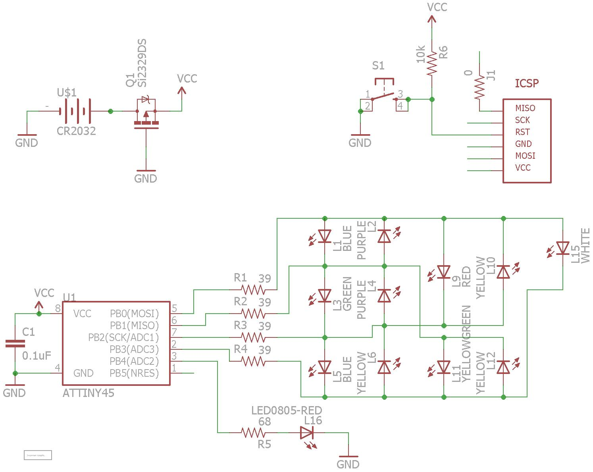
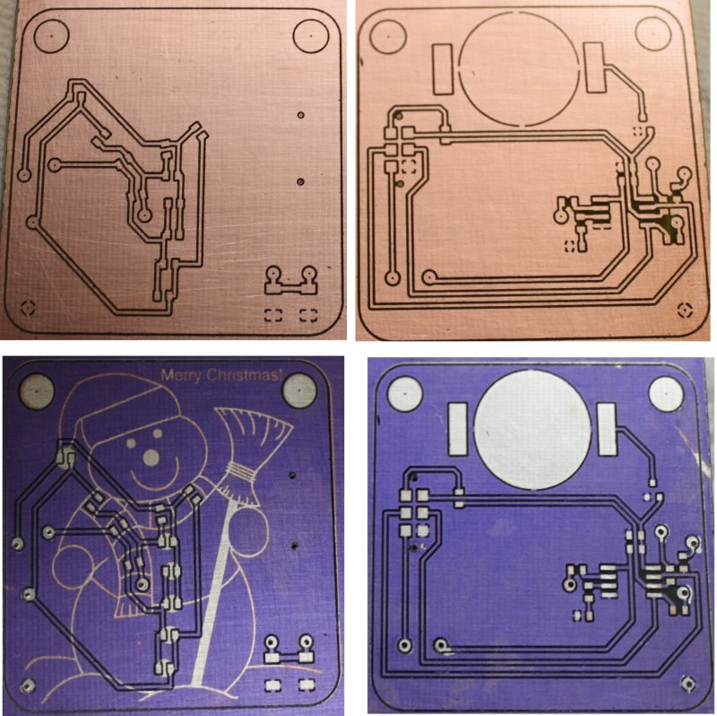
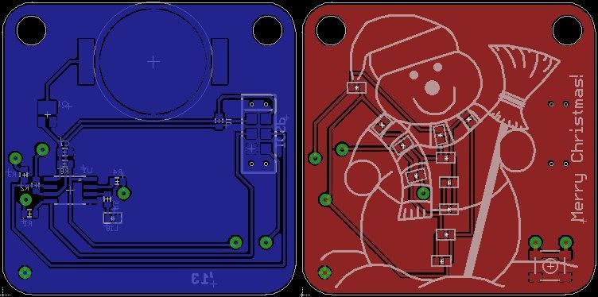
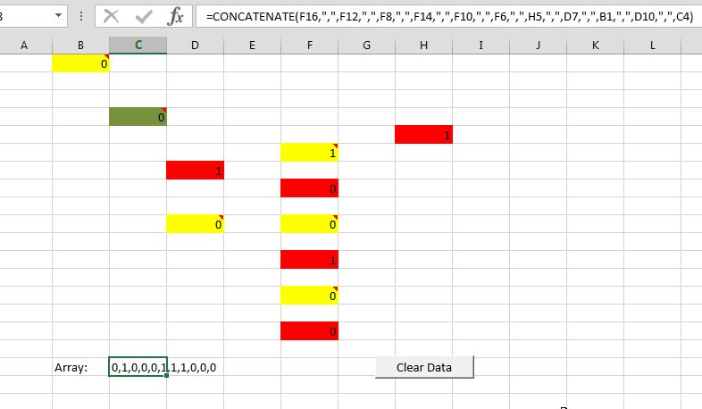
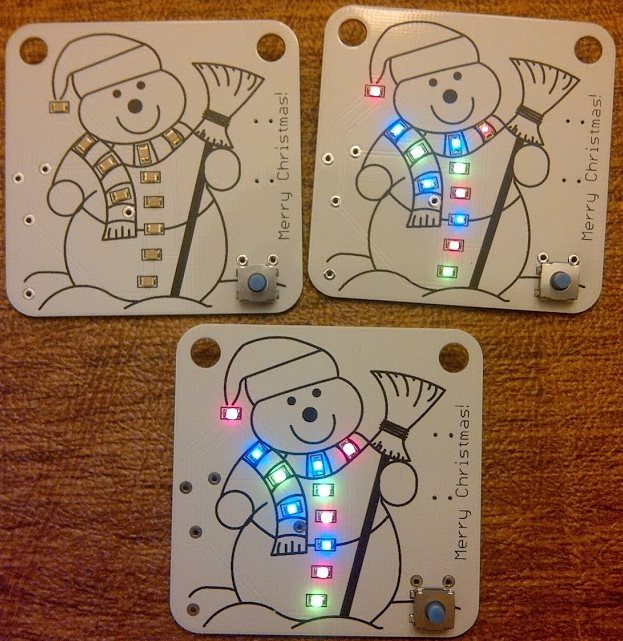
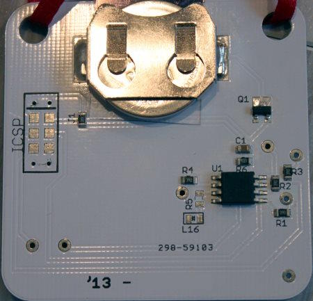

This is the first in a series of Christmas ornaments I started making in 2013.

***

I had been experimenting with the Attiny series of MCUs and the Arduino environment, so I decided to make it a little more interesting than just a bare PCB. Flashing lights! I searched google and found a lot more info than I thought I would, but they were all designed to be plugged into a wall outlet. It was clear that this would be more fun if it were an actual Christmas ornament hanging from the tree, and I hate dragging wires around the tree (especially for a single ornament).  So battery powered it must be.

Unfortunately, the number of LEDs I wanted to use (~12) would come out to a current drain of 240mA. That’s a lot for any battery, but especially a small battery. AAA batteries would probably work, but the low-voltage Attinys required at least 1.8V (1.6V works usually, but the LEDs wouldn’t work at that voltage anyway). Using 2 AAA batteries would probably cause the branches of most Christmas trees to bend so much the ornament would just fall off. I tried a few buck/boost converters (like the MCP1640) to see if I could run the ornament from a single AAA cell, but most of these are only about 85% efficiency (the best I ever got was 60%). The input power of the converter was fairly substantial (5-10mA idle). In addition, the boost converter would be operating constantly, so even if the LEDs weren't flashing, the battery would still have a 5-10mA draw on it. That's enough to drain a 1000mAh AAA battery in 4 days! I'm sure if I had spent more time trying to optimize the boost converter I could have made it work. The MCP1640 has an enable pin, so I could have used the MCU to put the converter to sleep, if I could find a charge pump that would work to wake the MCU, and then the converter. Too complicated...

I found an interesting technique for controlling many LEDs from only a few MCU pins, called [Charlieplexing](https://en.wikipedia.org/wiki/Charlieplexing)…  It’s a really simple concept, so if you haven't heard of it I suggest you read the wiki page. I did a little more research and found [the UnaClocker's blog](https://web.archive.org/web/20131228142659/http://www.neonsquirt.com/xmas_ornament2012.html), and he had already done what I was doing! Well, sort of. It was still wall-powered, but since charlieplexing never lights more than a single LED at once, the MAXIMUM current draw will be the MCU (which is a few milliamps, maybe) plus the current draw of a single LED. So, ~10mA. This could easily run from a 3V CR2032 watch battery. Small, lightweight, and available at every drug store!

I prototyped a  small panel of 12 charlieplexed LEDs and it worked great. I was able to control 12 separate LEDs from an Attiny85 (8-pin) MCU. The more LEDs you turn on at once, the dimmer they get (since it is multiplexing the LEDs and turning them on and off individually, very quickly).

Eventually I designed the PCB with the snowman on it, and etched a board for testing. You'll notice the PCB has a little pushbutton on it.  It's nothing fancy, it just resets the MCU which gives you the ability to "play" the light show whenever you want (the first thing the MCU does is run through the LED patterns, before going to sleep). Doing it this way also saves a pin in case I want  to add more LEDs to a future version.

Here's the schematic and some pics of the demo board:

 

I found that using a long list of *digitalWrite* commands to display a pattern wasn’t going to be very space efficient (these things max out at 8k, and I’d rather use the 4k version). I found [this instructable](https://www.instructables.com/CharliePlexed-LED-string-for-the-Arduino/) which uses a byte-array to store the patterns in the form of a single string of binary data representing a single "frame" of the pattern to display. It's just an array holding 1's and 0's.  

Matching each LED with the corresponding element of the array can be tricky, so I came up with an excel spreadsheet to help build the strings of bytes for each frame in the pattern. I used the *CONCATENATE* function to simply string the contents of all the cells into a single line separated by commas, just like in the array. I set the cells up with colored backgrounds so it looked like the LEDs on the PCB.  I also added a button macro to clear the cells out, so it would be a little easier to make each frame (I didn’t have to go reset each cell to 0, the button reset them all to 0 instantly). If you don't want to use the macro, simply build a new document using CONCATENATE (or whatever your office program provides).

That gave me a bunch of different patterns I could go through when lighting the LEDs. I found a nice little [battery run-time calculator](http://oregonembedded.com/batterycalc.htm) online, which helped me guess how long the batteries would last. It turns out, even at 10mA the CR2032 battery wouldn't last very long if it was running constantly.  Instead, it uses the hardware watchdog timer to wake the MCU every 8 seconds. It then increments a counter variable and goes back to sleep (it only draws a few microamps when sleeping). Once the counter reaches a certain value (SleepTime), it executes the functions to display LED patterns. 

Read through the code comments for an explanation of how that works, but basically you set SleepTime to however many seconds you want it to wait before it turns on again (so, 300=5 minutes, etc). Since I'm using the internal clocks of the MCUs (which are known to be very inaccurate) I also adjusted the times a little bit. if you want a 5 minute wake time, then you need to use something around 300, but 300 will almost certainly NOT be 5 minutes.

My first prototype lasted from the beginning of October through the following January. It really depends on the voltages of your LEDs. I liked blue and green (TRUE green) LEDs, which tend to have a forward voltage of 3V. that means the CR2032 battery (which is a 3V battery) has to be pretty full to get the LEDs to light up brightly.  They usually go out first, around 2.4V. The red and yellow LEDs actually continued to work for at least another month before I ended the test (the MCUs will work down to about 1.6V, below that they become unstable). I thought 5 months was plenty of battery life for something that was intended to last through December. That being said, I would avoid using blue since it starts to dim much quicker than the others.

I had the PCBs manufactured by iTead Studio and assembled them:

 

Here's the ornament in action:
[Snowman_video](media/Snowman.gif)

### Compiling

* Install [ATTinyCore](https://github.com/spencekonde/attinycore) using the boards manager
* Select **Attiny25/45/85 (No bootloader)** from the boards list
* Set the *Clock source* to **4MHz (internal)** (With newer versions, you may need to use 8MHz with a scalar variable to lower it to 4MHz)
* Set *B.O.D* to **Disabled**
* Select **Burn Bootloader** to write the changes
* Compile and write the program to the MCU

If using another method to program the MCU, just remember you need to set the fuses properly both for correct speed and for the power saving features. The fuses (for an ATTINY45) should be:

Low: C3  
High: DF  
Extended: FF

You can see the effect of different fuse settings (and their values) [here](http://www.engbedded.com/fusecalc/).

### Resources

**Charlieplexing Code using a byte array:**  
[https://www.instructables.com/CharliePlexed-LED-string-for-the-Arduino/](https://www.instructables.com/CharliePlexed-LED-string-for-the-Arduino/)

**Battery calculator:**  
[http://oregonembedded.com/batterycalc.htm](http://oregonembedded.com/batterycalc.htm)

**Power saving information:**  
[http://www.gammon.com.au/forum/?id=11497](http://www.gammon.com.au/forum/?id=11497)  
[http://www.insidegadgets.com/2011/02/05/reduce-attiny-power-consumption-by-sleeping-with-the-watchdog-timer](http://www.insidegadgets.com/2011/02/05/reduce-attiny-power-consumption-by-sleeping-with-the-watchdog-timer/)  
[http://www.nongnu.org/avr-libc/user-manual/group\_\_avr\_\_power.html](http://www.nongnu.org/avr-libc/user-manual/group__avr__power.html)
